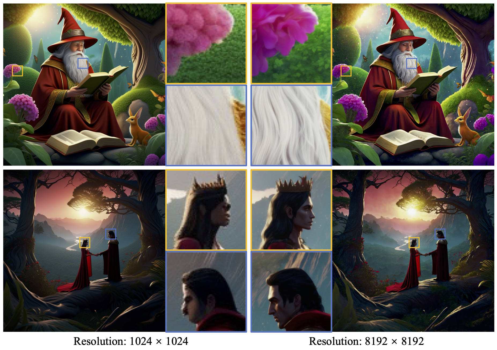

<p align="center">
    
</p>

## ___***FreeScale: Unleashing the Resolution of Diffusion Models via Tuning-Free Scale Fusion***___

### 🔥🔥🔥 FreeScale is a tuning-free method for higher-resolution visual generation, unlocking the 8k image generation! 
### 🚀🚀🚀 The extended work [CineScale](https://github.com/Eyeline-Labs/CineScale) for higher-resolution visual generation based on [Wan 2.1](https://github.com/Wan-Video/Wan2.1) is available, unlocking the 4k video generation!

<div align="center">
 <a href='https://arxiv.org/abs/2412.09626'></a> &nbsp;&nbsp;&nbsp;&nbsp;&nbsp;
 <a href='http://haonanqiu.com/projects/FreeScale.html'></a> &nbsp;&nbsp;&nbsp;&nbsp;&nbsp;
 <a href='https://huggingface.co/spaces/MoonQiu/FreeScale'></a>


_**[Haonan Qiu](http://haonanqiu.com/), [Shiwei Zhang*](https://scholar.google.com/citations?user=ZO3OQ-8AAAAJ), [Yujie Wei](https://weilllllls.github.io/), [Ruihang Chu](https://ruihangchu.com/), [Hangjie Yuan](https://jacobyuan7.github.io/), 
<br>
[Xiang Wang](https://scholar.google.com/citations?user=cQbXvkcAAAAJ), [Yingya Zhang](https://scholar.google.com/citations?user=16RDSEUAAAAJ), and [Ziwei Liu*](https://liuziwei7.github.io/)**_
<br><br>
(* Corresponding Author)

From Alibaba Group and Nanyang Technological University.


</div>

## ⚙️ Setup

### Install Environment via Anaconda
```bash
conda create -n freescale python=3.8
conda activate freescale
pip install -r requirements.txt
```


## 🤗 Quick start with [Gradio](https://www.gradio.app/guides/quickstart)

```bash
gradio gradio_app.py
```

## 💫 Inference with Command
### 1. Higher-Resolution Text-to-Image

1) Modify the `run_freescale.py` and input the following commands in the terminal.
2) Input the following commands in terminal:
```bash
python run_freescale.py

# resolutions_list: resolutions for each stage of self-cascade upscaling.
# cosine_scale: detail scale, usually 1.0 ~ 2.0. For 8k image generation, cosine_scale <= 1.0 is recommended.
```


### 2. Flexible Control for Detail Level

1) Modify the `run_sdxl.py` and generate the base image with the original resolutions.
2) Input the following commands in terminal:
```bash
python run_sdxl.py
```
3) Put the generated image into folder `imgen_intermediates`.
4) (Optional) Generate the mask using other segmentation models (e.g., [Segment Anything](https://huggingface.co/spaces/Xenova/segment-anything-web)) and put the mask into folder `imgen_intermediates`.
5) Modify the `run_freescale_imgen.py` and generate the final image with the higher resolutions.
6) Input the following commands in terminal:
```bash
python run_freescale_imgen.py

# resolutions_list: resolutions for each stage of self-cascade upscaling.
# cosine_scale: detail scale for foreground, usually 2.0 ~ 3.0. 
# cosine_scale_bg: detail scale for background, usually 0.5 ~ 1.0.
```


### 3. Faster Generation with SDXL-Turbo

1) Modify the `run_freescale_turbo.py` and input the following commands in the terminal.
2) Input the following commands in terminal:
```bash
python run_freescale_turbo.py

# num_inference_steps: 2 ~ 8.
# Currently, the resolution that exceeds 2048 x 2048 will introduce quality loss in the Turbo mode.
```


## 🧲 Tips
1. Generating 8k (8192 x 8192) images will cost around 55 GB and 1 hour on NVIDIA A800. 
2. Set `fast_mode = True` can significantly shorten the time but lead to some loss of quality especially for 8k image generation.
3. For 8k image generation, `cosine_scale <= 1.0` is recommended. Or use the Flexible Control for Detail Level function and set a small `cosine_scale_bg` (e.g., 0.5) for areas with artifacts. 
4. Potentially, real images or images generated by other models (e.g., FLUX) can be used as the intermediates of Flexible Control for Detail Level. In this way, FreeScale becomes an img-to-img approach. However, since SDXL may not be able to reconstruct the given content well, it is easy to make unexpected changes. Finding the prompt that allows SDXL to reconstruct the given content as much as possible is particularly important for the quality of the generation.

If your have any questions about FreeScale, feel free to contact [Haonan Qiu](http://haonanqiu.com/).


## 📝 Changelog
- __[2024.12.22]__: 🔥🔥 Release FreeScale for SDXL-Turbo, trading slight quality loss for a significant speedup.
- __[2024.12.13]__: 🔥🔥 Release FreeScale (based on SDXL), higher-resolution image generation!
<br>


## 🚀 My Free Series
[FreeNoise](https://github.com/AILab-CVC/FreeNoise): Tuning-free method for longer video generation.

[FreeTraj](https://github.com/arthur-qiu/FreeTraj): Tuning-free method for trajectory control.


## 😉 Citation
```bib
@article{qiu2024freescale,
  title={FreeScale: Unleashing the Resolution of Diffusion Models via Tuning-Free Scale Fusion},
  author={Qiu, Haonan and Zhang, Shiwei and Wei, Yujie and Chu, Ruihang and Yuan, Hangjie and Wang, Xiang and Zhang, Yingya and Liu, Ziwei},
  journal={arXiv preprint arXiv:2412.09626},
  year={2024}
}
```